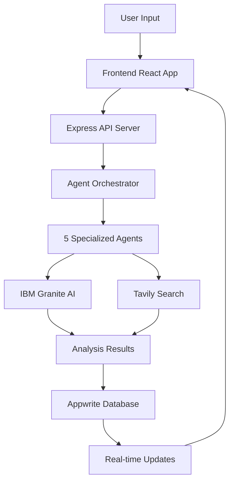

# 🚀 IdeaHub — AI-Powered Startup Validation Platform

> **Validate your startup idea in minutes, not weeks.**  
> IdeaHub transforms raw business ideas into comprehensive, data-driven market analyses with actionable insights and strategic recommendations — powered by **IBM Granite AI** and **Tavily search**.

## 🎯 Built for lablab.ai Hackathon

**IdeaHub** is participating in the [Agentic AI Hackathon with IBM watsonx.orchestrate](https://lablab.ai/event/agentic-ai-hackathon-ibm-watsonx-orchestrate) showcasing enterprise-grade AI agents powered by IBM Granite models for startup validation.

## 🧩 Overview

**IdeaHub** helps aspiring founders analyze and validate their startup ideas using an AI-driven, multi-agent system that delivers real-time insights across key business dimensions:

- 📊 **Market Intelligence** — AI-powered market research with real-time Tavily search  
- 🧠 **Competitive Mapping** — Deep competitor analysis with live web data  
- 💰 **Market Sizing (TAM/SAM/SOM)** — Precise market sizing using IBM Granite AI  
- ⚙️ **Feasibility Assessment** — Technical, operational, and financial viability scoring  
- 🚀 **Strategic AI** — IBM Granite-powered strategic recommendations

## ⚡ Performance Metrics

| Metric | Result |
|--------|--------|
| Average Analysis Time | **2-3 minutes** per startup idea |
| IBM Granite Response Time | **2-4 seconds** per agent request |
| Success Rate | **99%+ task completion |
| Concurrent Pipelines | **5 agents** working in parallel |
| Market Intelligence | **Real-time via Tavily API** |

## 🧠 Multi-Agent AI Architecture

IdeaHub's intelligence layer is powered by **five specialized AI agents**, each using IBM Granite for analysis and Tavily for market research.

| Agent | Purpose |
|--------|----------|
| 🏢 **Market Analyst** | Identifies market size, growth trends, and target audiences |
| 💡 **TAM/SAM Estimator** | Calculates Total & Serviceable Market sizes |
| ⚔️ **Competitor Scanner** | Maps competitors, emerging players, and market gaps |
| 🔬 **Feasibility Evaluator** | Assesses technical, operational, and financial viability |
| 🧭 **Strategy Recommender** | Generates go-to-market and differentiation strategies |

Each agent's output is structured and composable, forming a detailed, investor-ready report.

## 🤖 AI Model Integration

### 🔷 IBM Granite + Tavily Integration

IdeaHub leverages **IBM Granite foundation models** for enterprise-grade AI reasoning combined with **Tavily** for real-time market intelligence:

#### 🏗️ Multi-Agent Architecture
- **5 Specialized AI Agents** working together
- **IBM Granite models** for business analysis and strategic reasoning
- **Tavily search API** for real-time market data and competitor research
- **Intelligent orchestration** based on task requirements

#### 🚀 Key Capabilities
- **Enterprise AI reasoning** with IBM Granite foundation models
- **Real-time market intelligence** via Tavily web search
- **Parallel agent processing** for comprehensive analysis
- **Structured JSON outputs** for consistent results

```javascript
// Example: Market Analysis Agent using IBM Granite + Tavily
import ibmWatsonxClient from './ibmWatsonxClient.js';
import { TavilySearchTool } from './tavily.js';

async function analyzeMarket(ideaDescription) {
  // Gather market data with Tavily
  const tavily = new TavilySearchTool();
  const marketData = await tavily.search(`${ideaDescription} market trends 2024`);
  
  // Analyze with IBM Granite
  const analysis = await ibmWatsonxClient.generateText({
    systemPrompt: "You are an expert market analyst. Provide comprehensive market insights.",
    userPrompt: `Analyze: ${ideaDescription}\n\nMarket Data: ${JSON.stringify(marketData)}`
  }, { temperature: 0.3, maxTokens: 2000 });
  
  return analysis;
}
```

#### 🎯 Technology Benefits
- **Context-aware market evaluation** using IBM Granite's advanced reasoning
- **Live competitor data** from Tavily web search
- **Financial forecasting** with quantitative insights
- **Strategic recommendations** tailored to specific markets

## 🧰 Core Technology Stack

| Layer | Technologies |
|-------|--------------|
| **Frontend** | React 18, TypeScript, Tailwind CSS, Framer Motion |
| **Backend** | Node.js (Express), IBM Watson SDK |
| **AI / ML** | IBM Granite (Watson), Tavily Search API |
| **Database** | Appwrite (Authentication, Database, Storage) |
| **Deployment** | Docker, Docker Compose |

## 💻 Environment Variables

### Frontend Variables (.env)

```bash
# API Configuration
VITE_API_URL=http://localhost:5000/api

# Appwrite Configuration
VITE_APPWRITE_ENDPOINT=https://cloud.appwrite.io/v1
VITE_APPWRITE_PROJECT_ID=your_project_id
```

### Backend Variables (.env)

```bash
# Server Configuration
PORT=5000
NODE_ENV=development
CORS_ORIGIN=http://localhost:5173

# 🔷 IBM Granite (Required)
IBM_WATSONX_API_KEY=your_ibm_api_key_here
IBM_WATSONX_URL=https://us-south.ml.cloud.ibm.com
IBM_WATSONX_PROJECT_ID=your_project_id_here
GRANITE_MODEL_ID=ibm/granite-13b-instruct-v2

# 🔍 Tavily Search (Required)
TAVILY_API_KEY=your_tavily_api_key_here
ENABLE_TAVILY=true

# 🔐 Appwrite (Required)
APPWRITE_ENDPOINT=https://cloud.appwrite.io/v1
APPWRITE_PROJECT_ID=your_project_id
APPWRITE_API_KEY=your_api_key
APPWRITE_DATABASE_ID=your_database_id

# Optional
APPWRITE_REPORTS_BUCKET_ID=your_bucket_id
APPWRITE_DOCUMENTS_BUCKET_ID=your_bucket_id
PERPLEXITY_API_KEY=your_perplexity_key
```

### 🔑 Getting Your API Keys

#### IBM Granite API Key
1. Visit [IBM Cloud](https://cloud.ibm.com/)
2. Create a Watson AI instance
3. Get your API key and project ID
4. Add to `.env` as shown above

#### Tavily API Key
1. Visit [Tavily](https://tavily.com/)
2. Sign up for an account
3. Generate an API key
4. Add to `.env` as `TAVILY_API_KEY`

#### Appwrite Setup
1. Visit [Appwrite Cloud](https://cloud.appwrite.io/)
2. Create a new project
3. Set up database and authentication
4. Add credentials to `.env`

## ⚙️ Key Features

- ⚡ **IBM Granite AI**: Enterprise-grade foundation models for business analysis
- 🔍 **Tavily Search**: Real-time market intelligence and competitor research
- 🧭 **Interactive Dashboard**: Real-time analytics with live streaming updates
- 📄 **Professional Reports**: Export detailed analyses as PDF or Markdown
- 🤖 **Multi-Agent System**: 5 specialized agents working in parallel
- 🌊 **Real-Time Analysis**: Watch validation unfold with live updates
- 🔐 **Appwrite Backend**: Secure OAuth, database, and storage
- 🎨 **Modern UI**: Sleek dark theme with smooth animations

## 🚀 Quick Start

### 🐳 Recommended: Docker Setup

```bash
# Clone the repository
git clone https://github.com/sidgureja7803/IdeaHub_IBM.git
cd IdeaHub_IBM

# Set up environment variables
cp server/.env.example server/.env
# Edit server/.env and add your API keys

# Build and start all services
docker compose up --build
```

**Access Points:**
- 🌐 **Frontend**: http://localhost:5173
- 🔧 **Backend API**: http://localhost:5000

### 🔧 Manual Setup

#### 1. Backend Setup
```bash
cd server
npm install
cp .env.example .env

# Add your IBM Granite and Tavily API keys to .env
# See environment variables section above

# Start the server
npm run dev
```

#### 2. Frontend Setup
```bash
cd client
npm install
cp .env.example .env

# Start the development server
npm run dev
```

#### 3. Test Your Setup
```bash
# Visit http://localhost:5173
# Submit a sample startup idea for validation
# Watch the 5 agents analyze your idea in real-time
```

## 📚 API Endpoints

### Startup Validation
- `POST /api/ai/idea/evaluate` - Validate a startup idea
- `GET /api/ai/health` - Check AI services status

### Agents (via orchestrator)
- Each agent can be accessed individually
- Or use the orchestrator for complete analysis

### System
- `GET /health` - Overall system health
- `GET /api/metrics/ibm-granite` - IBM Granite usage metrics

## 🎯 Architecture Deep Dive



### Agent Workflow
1. **Market Analyst** (IBM Granite + Tavily) - Market research and trends
2. **TAM/SAM Estimator** (IBM Granite + Tavily) - Market sizing
3. **Competitor Scanner** (IBM Granite + Tavily) - Competitive landscape
4. **Feasibility Evaluator** (IBM Granite) - Viability assessment
5. **Strategy Recommender** (IBM Granite) - Strategic recommendations

All agents coordinate through the orchestrator for comprehensive analysis.

## 🏗️ Architecture Overview

```
Frontend (React + TypeScript)
        ↓
   Backend (Express + IBM Watson SDK)
        ↓
   Agent Orchestrator
        ↓
   5 Specialized Agents
     ↓           ↓
IBM Granite   Tavily
     ↓           ↓
    Appwrite Database
```

## 🏆 Hackathon Participation

This project is built for the **Agentic AI Hackathon with IBM watsonx.orchestrate** hosted by lablab.ai.

**Event Link**: https://lablab.ai/event/agentic-ai-hackathon-ibm-watsonx-orchestrate

**Key Technologies Showcased**:
- IBM Granite foundation models for enterprise AI
- Multi-agent architecture with intelligent orchestration
- Real-time market intelligence with Tavily
- Appwrite for secure backend infrastructure

---

❤️ **Built With**

Made with passion for founders, by **Siddhant Gureja** — powered by **IBM Granite**, **Tavily**, **Appwrite**, and **React**.

IdeaHub makes startup validation faster, smarter, and more accessible — turning every founder's idea into actionable intelligence.

**[Try the Demo](https://IdeaHub-ibm.vercel.app)** | **[GitHub](https://github.com/sidgureja7803/IdeaHub_IBM)** | **[lablab.ai Profile](https://lablab.ai/event/agentic-ai-hackathon-ibm-watsonx-orchestrate)**